# 유니티 및 GitHub 사용 방법

## GitHub Desktop 설치

[GitHub Desktop | Simple collaboration from your desktop](https://desktop.github.com/)

위 링크에서 GitHub Desktop을 설치해줍니다.

설치하고 열면 GitHub  로그인이 필요한데 로그인해주세요.

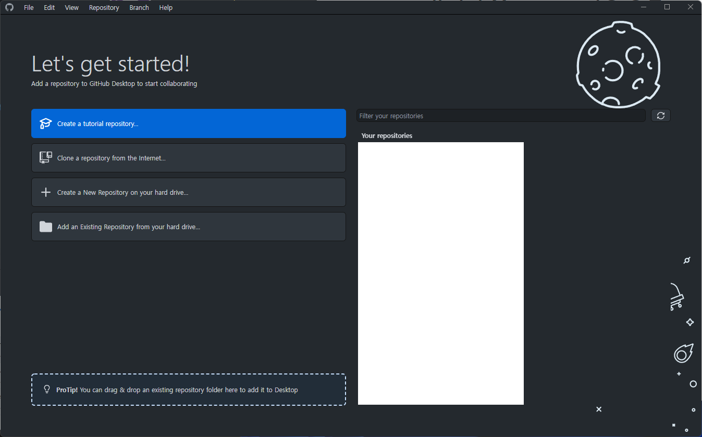

로그인을 하면 위와 같은 화면이 됩니다.

중앙 버튼 중 2번째의 'Clone a repository from the Internet' 버튼을 누르고 'wckgj22' 를 검색하고 선택합니다.

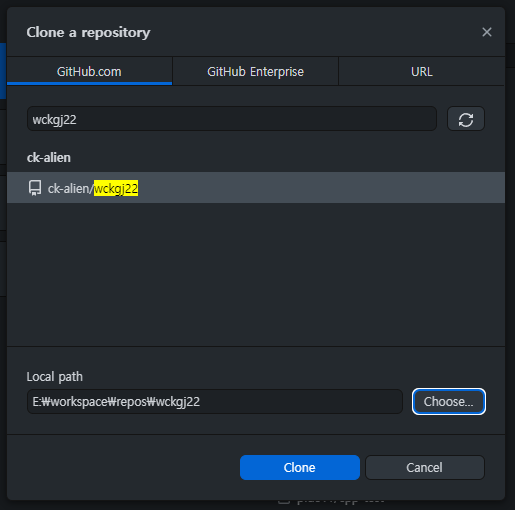

Local path에 유니티 프로젝트 폴더가 위치할 경로를 선택해주세요.

이제 유니티로 프로젝트를 열 차례입니다.

유니티 버전은 `2021.2.15f1` 버전을 사용합니다.

유니티 허브를 열고 Install Editor -> OTHER VERSIONS에서 해당 버전을 설치해주세요.

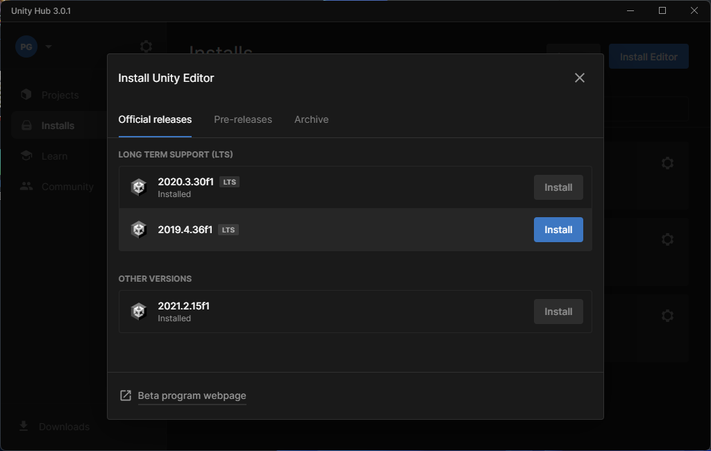

설치가 완료되면 Projects의 Open 버튼을 눌러 아까 프로젝트를 클론한 경로에서 `WCKGJ-2022` 폴더를 선택하여 열면 유니티 프로젝트가 열립니다.

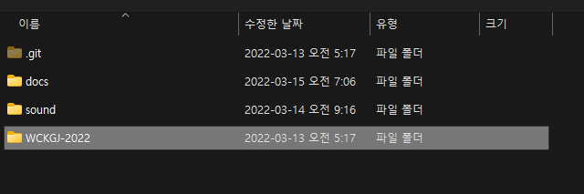

처음 프로젝트를 열 때 라이브러리들을 다운로드하기 때문에 오래 걸립니다!

## 프로젝트 구조

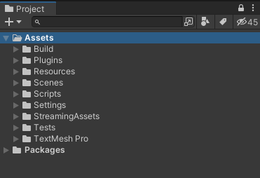

유니티 프로젝트 구조는 현재 위의 이미지와 같이 구성되어 있습니다.

| 폴더 이름 | 설명                                                         |
| :-------- | ------------------------------------------------------------ |
| Build     | 프로젝트를 빌드 할 때 사용할 수 있는 설정 파일이 들어 있습니다. |
| Resources | 주로 그래픽 리소스들을 넣는 폴더입니다.                      |
| Scenes    | 게임씬들이 들어 있습니다. MainScene에서 주로 작업합니다.     |
| Scripts   | 게임 스크립트들이 들어 있습니다.                             |

그래픽 리소스들은 모두 Resources 폴더 안에 들어간다는 것 정도만 알고 계시면  됩니다.

## Git 사용 방법

## 브랜치 관리

유니티 프로젝트에서 작업하시기 전에 브랜치를 따로 만든 뒤에 해당 브랜치에서 작업을 하셔야 합니다.

기본적으로 새로운 브랜치는 `dev` 브랜치에서 만듭니다.

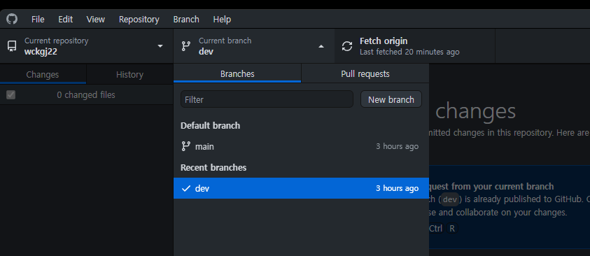

GitHub Desktop에서 상단의 Current branch 클릭 -> dev 선택
이렇게 해서 dev 브랜치로 변경이 가능합니다.

이제 dev 브랜치에서 새로운 작업 브랜치를 만드셔야 합니다.

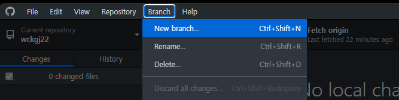

상단 Branch 메뉴 -> New branch 클릭

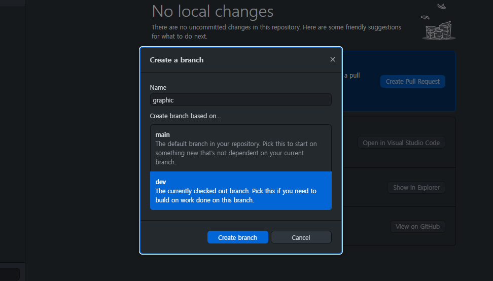

Name: 아래의 내용을 참고하여 지어주세요.
Create branch based on... : dev 선택

**기획 / 그래픽 분들의 경우 브랜치 이름:**

그래픽은 한명이므로 `graphic` 으로 이름을 지어주세요.

기획은 여러명이기 때문에 `design/[별칭]` 으로 별칭 부분을 본인을 특정할 수 있는 이니셜 등을 적어주시면 됩니다. (design/aaa, design/bbb)

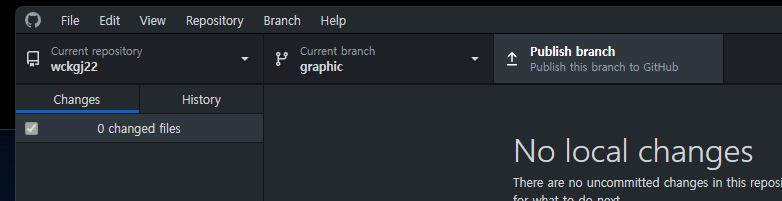

브랜치를 만드셨으면 Current branch 이름이 제대로 되어 있는지 확인하신 후 옆의 Publish branch를 눌러서 원격 브랜치를 생성해주세요.

**프로그래머의 경우 브랜치 이름:**

기능 개발의 경우: `feature/[이름]`
버그 픽스의 경우: `bugfix/[이름]`

### 작업 내용 커밋 후 푸시 방법

유니티 프로젝트에서 리소스를 추가하거나, 값을 변경하는 등 작업을 다 하셨으면 먼저 프로젝트를 저장해주세요.

프로젝트를 저장하시고나서 GitHub Desktop을 보시면 변경 사항들이 생깁니다.

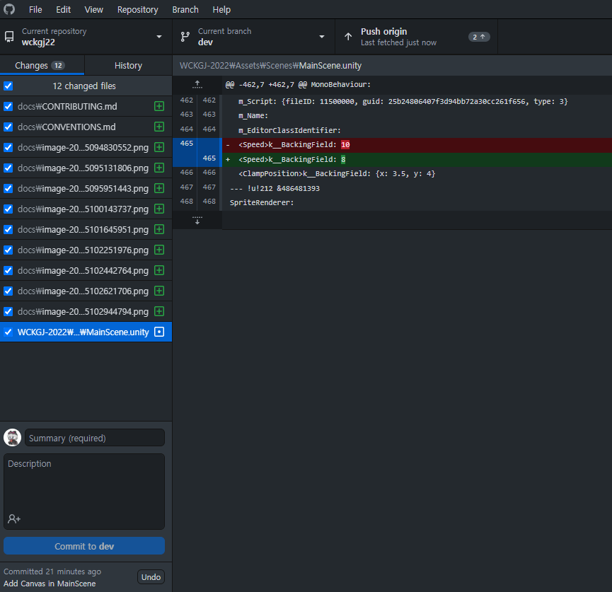

변경 사항들은 한번 확인해보고, 커밋하기 위해서는 좌측 하단의 Summary와 Description을 필요에 맞게 채워줍니다.

Summary에는 어떤 것을 추가하거나 변경했지 요약을 한 문장 정도로 적어주시면 되고, Description은 적지 않아도 되나 꼭 필요한 설명이 있을 경우에만 적어주시면 됩니다.

다 적으시면 파란색 [Commit to '브랜치 명'] 으로 적혀 있는 버튼을 눌러 커밋해주세요.

커밋이 완료되면 상단의 'Push origin' 버튼을 눌러 원격 브랜치로 푸시해줍니다.

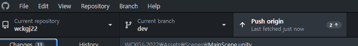

이후에는 dev 브랜치로 작업 내용을 머지해야 하는데, 이 부분은 **플머 분께 부탁하시면 해드립니다!**

dev에 머지까지 완전히 끝난 다음 새로운 작업을 하기 전에 본인의 브랜치를 최신화해야 합니다.
최신화 작업은 플머가 해주므로 플머가 작업이 다 됐다고 하면 Push origin 자리에 `Pull` 버튼이 생길겁니다.

Pull 버튼을 눌러 본인 브랜치를 최신화합니다.
